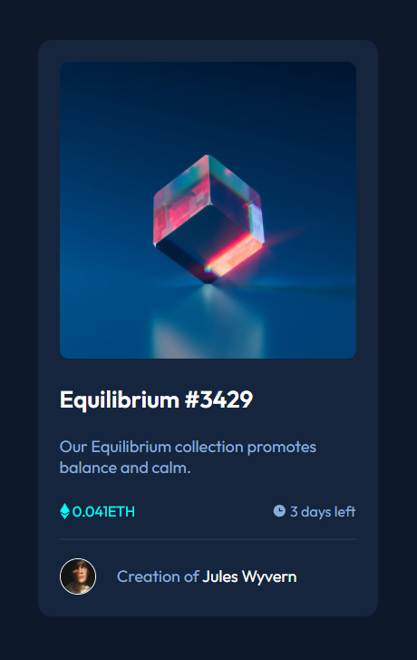

# Frontend Mentor - NFT preview card component solution

This is a solution to the [NFT preview card component challenge on Frontend Mentor](https://www.frontendmentor.io/challenges/nft-preview-card-component-SbdUL_w0U). Frontend Mentor challenges help you improve your coding skills by building realistic projects. 

## Table of contents

- [Overview](#overview)
  - [Screenshot](#screenshot)
  - [Links](#links)
- [My process](#my-process)
  - [Built with](#built-with)
  - [Useful resources](#useful-resources)
- [Author](#author)

## Overview

### Screenshot

### Links

- Solution URL: [Add solution URL here](https://xjomampx.github.io/NTF-Card-Component/)

## My process

### Built with

- Semantic HTML5 markup
- CSS custom properties
- Flexbox
- Mobile-first workflow
- SASS preprocessor

### Useful resources

- [Jonmircha](https://www.youtube.com/channel/UCXR7VjA26PcHP3vb6F2X3VQ) - this creator content help me to understand about the functions css and how to use them
- SASS documentation

## Author

- Frontend Mentor - [@xJomaMPx](https://www.frontendmentor.io/profile/xJomaMPx)